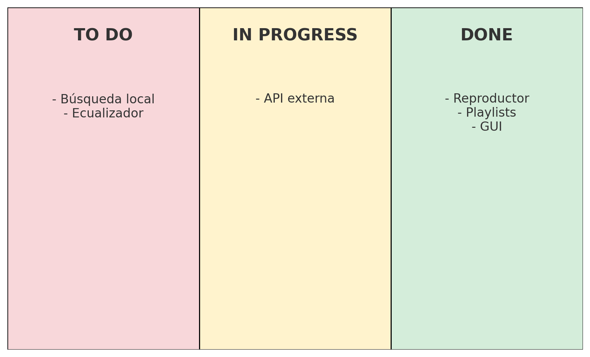

# E05 – Tablero Kanban del Proyecto

A continuación se presenta el tablero Kanban utilizado para monitorear el progreso del proyecto.

## Estado actual (To Do – In Progress – Done)

### To Do
- Implementar búsqueda local (HU-04)
- Agregar ecualizador o mejoras visuales (PB-07)

### In Progress
- Integración de API externa (HU-05)

### Done
- Reproducción local (HU-01)
- Controles multimedia (HU-02)
- Sistema de playlists (HU-03)
- Interfaz gráfica JavaFX (PB-04)

## Imagen del tablero

